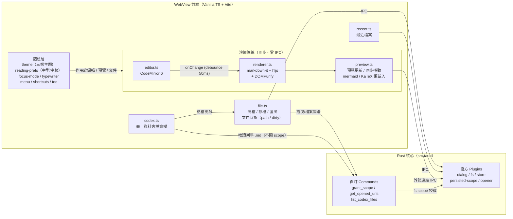

# Plume 🪶

[](LICENSE)
[](https://tauri.app/)
[](https://www.typescriptlang.org/)
[](https://codemirror.net/)

[English](README_EN.md)

開檔即閱讀、落筆即沉浸的桌面 Markdown 工具。讀別人的 `.md` 是渲染好的全幅閱讀，寫自己的有專注模式、打字機捲動、KaTeX 數學與 mermaid 圖表。Tauri 2 原生應用——輕量、無帳號、無外掛生態。

<p align="center">
  
</p>

## 功能特色

Plume 把讀寫分成三態——撰（沉浸寫）、參（對照寫）、閱（沉浸讀）：開檔進「閱」，動筆切「撰」，要邊寫邊看預覽就用「參」。讀和寫對等，兩邊都做到位。

### 閱讀

| 功能 | 說明 |
|------|------|
| **三態切換（撰／參／閱）** | 工具列三段鈕直接切：撰＝隱藏預覽、編輯器置中沉浸；參＝左右分欄對照；閱＝全幅閱讀（預覽置中 800px）。開既有檔進「閱」、新檔進「撰」，Cmd/Ctrl+E 一鍵進「撰」 |
| **目錄導覽** | 閱讀模式下按「目錄」展開側邊 TOC，h1–h6 階層縮排，點擊跳轉，內容異動自動更新 |
| **全螢幕閱讀** | 隱藏工具列與狀態列，只留內容與捲動；右上角 ✕ 或 Escape 退出，TOC 仍可使用 |
| **拖曳開檔 / 資料夾** | 拖 `.md` 進視窗直接開啟；拖資料夾自動找 README.md 開啟——開發者丟專案即見 README |
| **檔案關聯** | macOS Finder 右鍵 → 以 Plume 打開，或設為 `.md` 的預設應用程式；app 已開著時再雙擊另一個 `.md` 會在同一視窗載入 |
| **最近檔案** | 最近 10 筆跨重啟有效，檔案存取權限一併記住 |
| **冊（Codex）** | 把整個資料夾開成「冊」：側邊欄以巢狀樹列出底下所有 `.md`，點檔即開、可同時掛多個冊下拉切換，切回時重新列舉反映檔案異動。唯讀瀏覽——新增／刪除／改名交給檔案總管，app 不碰目錄寫權限。工具列「冊」鈕或選單 File ▸ Open Codex Folder 開啟 |

### 寫作

| 功能 | 說明 |
|------|------|
| **CodeMirror 6 編輯器** | 行號、Markdown 語法高亮、搜尋取代、undo/redo；注音輸入法組字實測不斷字 |
| **即時預覽** | 「參」分欄下輸入後 50ms 內更新，所見即所得 |
| **專注模式** `⌘⇧F` | 只有游標所在的段落完全可見，其餘淡出——段落邊界由空行決定，移動游標時即時跟隨；只在「撰」沉浸態生效 |
| **打字機模式** `⌘T` | 游標行永遠固定在畫面垂直中央，打字時文字向上捲動；文件頂部也能置中（撰態專屬） |
| **複製為 HTML** `⌘⇧C` | 把 Markdown 渲染成 HTML 複製到剪貼簿，直接貼進 CMS 或部落格的 HTML 編輯器；含數學公式時自動轉為 MathML |
| **匯出 HTML** | 產出單一自帶樣式的 `.html`，瀏覽器開啟與預覽所見一致 |

### 渲染

| 功能 | 說明 |
|------|------|
| **GFM** | 表格、任務清單、刪除線、autolink，開箱即用 |
| **程式碼高亮** | highlight.js 只註冊 16 種常用語言（JS/TS/Python/Rust/Go/Java/C/C++/Bash/JSON/YAML/SQL/HTML/CSS/Markdown/diff），不開自動偵測，不為冷門語言付出載入成本 |
| **Mermaid 圖表** | ` ```mermaid ` 區塊即時渲染為 SVG——flowchart、sequence、class、ER、Gantt 等，跟隨佈景主題自動配色（懶載入，無圖表的檔案不付出成本） |
| **KaTeX 數學公式** | 行內 `$...$` 與獨立 `$$...$$` 數學式渲染，懶載入——沒有數學的檔案不會載入 KaTeX |
| **腳註** | `[^1]` 語法腳註，預覽底部自動產生腳註區塊，點擊引用可跳轉 |
| **Front matter 隱藏** | YAML front matter（`---` 包圍）不會出現在預覽中 |
| **安全渲染** | 所有輸出過 DOMPurify 消毒——開別人給的含 `<script>` 的 `.md` 也不怕 |

### 個人化

| 功能 | 說明 |
|------|------|
| **三態佈景主題** | 夜航（深色，預設）、硯墨（淺色）、Auto（跟隨系統明暗自動切換）；選擇記住，重開不用重選 |
| **閱讀字型** | 預設 / Serif / Sans / Mono 四選一，`⌘=` / `⌘-` / `⌘0` 即時調整字級（12–24px） |
| **原生選單列** | Plume / File / Edit / View / Help 系統原生選單 |
| **快捷鍵提示** | `⌘/` 叫出 cheat sheet 浮層，按鍵標示隨平台自適應（macOS `⌘` / Windows `Ctrl`） |

## 系統架構



**設計原則**：讀寫雙主——開檔進全幅閱讀（閱），動筆切沉浸寫作（撰），讀寫對等而非主從，要邊寫邊對照就用分欄（參）；專注、打字機、即時預覽在寫作態一個不少。Markdown 渲染管線完整留在前端（同步、零 IPC、零 race condition），mermaid 與 KaTeX 是懶載入的後處理；圍繞這條主幹的是體驗層（主題、字型、專注/打字機、選單、目錄、冊），不改變資料流，只調整呈現。Rust 端負責檔案 I/O、對話框、系統整合，以及三個自訂 command——`grant_scope`（拖曳與檔案關聯的外部路徑授權，含 symlink 解析與副檔名驗證，也處理資料夾拖曳的 README 查找）、`get_opened_urls`（OS 傳入的冷啟動檔案路徑），以及 `list_codex_files`（冊的資料夾唯讀遞迴列舉 `.md`，只回路徑、完全不開目錄 fs scope——「能列目錄」不等於「能讀內容」，點檔仍走 `grant_scope` 單檔授權，承重牆零增量）。

## 技術棧

| 技術 | 版本 | 用途 |
|------|------|------|
| Tauri | 2.x | 桌面應用框架（Rust shell + 系統 WebView） |
| TypeScript + Vite | TS 5.x / Vite 6 | 前端語言與建置工具，零 UI 框架 |
| CodeMirror | 6（`codemirror` meta 套件 + `@codemirror/lang-markdown`） | 編輯器：行號、Markdown 語法高亮、搜尋取代、IME 支援 |
| markdown-it | 14.x | Markdown → HTML（GFM：表格/刪除線內建，linkify 開啟） |
| markdown-it-task-lists | 2.x | GFM 任務清單 checkbox |
| markdown-it-footnote | 4.x | `[^1]` 腳註語法 |
| highlight.js | 11.x | 程式碼區塊語法上色（僅註冊 16 語言子集） |
| KaTeX | 0.17.x | 數學公式渲染（懶載入，`trust: false` + `maxSize: 20`） |
| mermaid | 11.x | 圖表渲染（懶載入，`securityLevel: "strict"`） |
| DOMPurify | 3.x | 渲染輸出 XSS 消毒（必備，見 SPEC 安全章節） |
| Tauri Plugins | 2.x | dialog / fs / store / persisted-scope / opener |
| Vitest | 4.x | 單元測試（65 個，渲染管線與冊樹建構為主） |

> Front matter 隱藏改用 `render()` 前置 regex 剝除，不走 `markdown-it-front-matter`——該套件對「以 `---` 開頭但無閉合」的文件有整段吃掉的 edge case。

## 安裝

### 直接下載

從 [Releases](https://github.com/tznthou/plume/releases) 下載對應平台的安裝檔：

| 平台 | 安裝檔 |
|------|--------|
| macOS（Apple Silicon） | `Plume_x.y.z_aarch64.dmg` |
| macOS（Intel） | `Plume_x.y.z_x64.dmg` |
| Windows x64 | `Plume_x.y.z_x64-setup.exe`（NSIS）或 `Plume_x.y.z_x64_en-US.msi` |

> **macOS 首次開啟**：安裝檔未經 Apple 公證（個人工具，沒走付費簽章），Gatekeeper 會攔下。對 Plume.app 按右鍵 →「打開」確認一次即可；或在終端機執行 `xattr -cr /Applications/Plume.app`。
>
> **Windows**：由 CI 打包，尚未在實機完整驗證（輸入法、檔案對話框等行為），遇到問題請開 issue。

### 從原始碼建置

前置需求：

- macOS 13+（開發機已驗證：rustc 1.88 / Node 22 / Xcode CLT）
- Rust toolchain（`rustup`）
- Node.js 22+ 與 npm

```bash
git clone https://github.com/tznthou/plume.git && cd plume
npm install
npm run tauri dev     # 啟動開發視窗（含熱更新）
npm run tauri build   # 產出 .app 於 src-tauri/target/release/bundle/
npm run test          # Vitest 單元測試
```

> Release profile 已開 LTO + strip + codegen-units 1 + panic abort，打包後的 binary 約 4.9 MB。

## 專案結構

```
markdown-tool/
├── index.html              # 版面骨架：工具列 + 撰／參／閱 三態 + 冊側邊欄
├── src/                    # 前端（Vanilla TS）
│   ├── main.ts             # 進入點：模組組裝、模式切換
│   ├── editor.ts           # CodeMirror 6 封裝
│   ├── renderer.ts         # markdown-it + hljs + DOMPurify 渲染管線（含 KaTeX 解析規則）
│   ├── preview.ts          # 預覽更新、同步捲動、外部連結攔截、mermaid/KaTeX 懶載入渲染
│   ├── toc.ts              # 目錄導覽：heading 擷取 + 點擊跳轉
│   ├── file.ts             # 開檔/存檔/另存/匯出 HTML、文件狀態（路徑、dirty）
│   ├── recent.ts           # 最近開啟檔案（plugin-store）
│   ├── codex.ts            # 冊（Codex）：資料夾唯讀列舉 + 巢狀檔案樹 + 多冊切換
│   ├── theme.ts            # 三態佈景主題（夜航/硯墨/Auto），matchMedia 監聽系統明暗
│   ├── reading-prefs.ts    # 閱讀字型與字級偏好（plugin-store 持久化）
│   ├── focus-mode.ts       # 專注模式：游標段落聚焦、其餘淡出
│   ├── typewriter.ts       # 打字機模式：游標行固定畫面中央
│   ├── menu.ts             # 原生選單列（@tauri-apps/api/menu，JS 端建構）
│   ├── shortcuts.ts        # 快捷鍵提示浮層（cheat sheet）
│   ├── statusbar.ts        # 狀態列：字數/行數/渲染時間/未儲存指示
│   └── style.css           # 版面 + 雙主題 + 撰／參／閱 三態 + 預覽 typography
├── src-tauri/              # Rust 核心
│   ├── src/lib.rs          # Tauri 啟動 + plugin 註冊 + 自訂 commands
│   ├── capabilities/       # IPC 權限宣告（最小化原則）
│   ├── permissions/        # 自動生成的 command ACL
│   └── tauri.conf.json     # 視窗、CSP、bundle、檔案關聯設定
├── tests/                  # Vitest 測試
├── docs/                   # 規格文件
│   ├── PRD.md              # 需求與使用者故事
│   ├── SPEC.md             # 架構、模組職責、IPC 邊界、安全
│   └── PLAN.md             # 實作路線圖與冒煙清單
├── CHANGELOG.md            # 版本紀錄（中文，另有 CHANGELOG_EN.md）
├── LICENSE                 # Apache 2.0
├── README.md               # 中文說明（本檔）
└── README_EN.md            # English README
```

版本演進見 [CHANGELOG](CHANGELOG.md)。

---

## 隨想

### 為什麼做這個

會大量讀寫 `.md`，其實是 AI 時代帶來的。以前 Markdown 對我來說就是 Obsidian 裡的格式，概念上跟純文字沒差。但現在 AI 的產出、專案文件、技術筆記全是 Markdown——它變成日常格式了。

問題是 Markdown 原始碼能讀，渲染後長什麼樣卻看不出來。表格、任務清單、程式碼區塊都得渲染才見真章，不像 Word 開了就是排好的版面。於是每次想看一個 `.md`，要不開 Obsidian vault，要不丟瀏覽器外掛，要不 push 上 GitHub。就「讀一份文件」這件事來說，繞得太遠了。

所以我做了一個自己的版本：開了就能讀，要改一鍵切編輯，沒有 vault、沒有帳號、沒有外掛生態。名字也想過——Plume，法文裡的羽毛，也是落筆的羽毛筆。輕，而且我會拿來閱讀，並且用心寫字。

### 為什麼閱讀器也要好寫

一開始只想要個閱讀器。但既然開了就能改，那「改」這件事就不能將就。寫長文的時候，滿屏的段落會分心，於是有了專注模式——只有游標所在的段落是亮的，其餘淡下去。一直往下打字，視線得追著游標跑到螢幕底，於是有了打字機模式——游標行釘在正中央，文字往上捲，眼睛不用動。寫完要貼到別的地方，於是有了複製 HTML，連數學公式都幫你轉成 MathML。

這些都是 Byword 那類沉浸式寫作工具教我的事。Plume 想把「開箱即讀」和「寫得舒服」放進同一個視窗——讀別人的，也寫自己的。

---

## 周邊概念設計

夜航主題裡的狐狸跑出了 app，變成了手機殼、滑鼠墊和貼紙。

<p align="center">
  
  
  
</p>

---

## 授權

本專案採用 [Apache 2.0](LICENSE) 授權。

## 作者

tznthou - [tznthou@gmail.com](mailto:tznthou@gmail.com)
