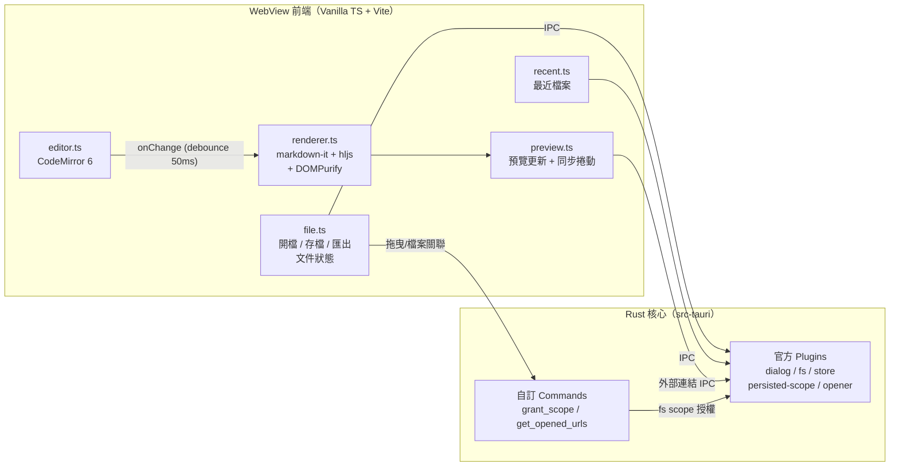

# Plume 🪶

[](LICENSE)
[](https://tauri.app/)
[](https://www.typescriptlang.org/)
[](https://codemirror.net/)

[English](README_EN.md)

輕量 Markdown 編輯器——左邊寫，右邊即時看渲染。Tauri 2 桌面應用，開了就能寫，存了就能走。

<p align="center">
  
</p>

## 功能特色

| 功能 | 說明 |
|------|------|
| **即時預覽** | 輸入後 50ms 內更新；GFM 表格、任務清單、刪除線、autolink |
| **編輯器** | CodeMirror 6：行號、Markdown 語法高亮、搜尋取代、undo/redo；注音輸入法組字實測不斷字 |
| **程式碼高亮** | highlight.js 只註冊常用語言子集，不為冷門語言付出載入成本 |
| **安全渲染** | 所有輸出過 DOMPurify 消毒——開別人給的含 `<script>` 的 `.md` 也不怕 |
| **同步捲動** | 編輯區捲動，預覽區按比例跟隨 |
| **匯出 HTML** | 產出單一自帶樣式的 `.html`，瀏覽器開啟與預覽所見一致 |
| **最近檔案** | 最近 10 筆跨重啟有效，檔案存取權限一併記住 |
| **拖曳開檔** | 把 `.md` 拖進視窗就能開——拖曳中有跟著佈景走的邊框提示，有未存內容會先確認 |
| **檔案關聯** | macOS Finder 右鍵 → 以 Plume 打開，或設為 `.md` 的預設應用程式；app 已開著時再雙擊另一個 `.md` 會在同一視窗載入 |
| **快捷鍵** | Cmd/Ctrl + N 新檔、O 開檔、S 存檔、Shift+S 另存；未儲存變更關閉視窗會攔下確認 |

## 系統架構



**設計原則**：Markdown 渲染管線完整留在前端（同步、零 IPC、零 race condition）；Rust 端負責檔案 I/O、對話框、系統整合，以及兩個自訂 command——`grant_scope`（拖曳與檔案關聯的外部路徑授權，含 symlink 解析與副檔名驗證）和 `get_opened_urls`（OS 傳入的冷啟動檔案路徑）。這是 Tauri 相對 Electron 的記憶體優勢來源，也避免把解析搬到 Rust 反而被 IPC 序列化成本吃掉的陷阱。

## 技術棧

| 技術 | 版本 | 用途 |
|------|------|------|
| Tauri | 2.x | 桌面應用框架（Rust shell + 系統 WebView） |
| TypeScript + Vite | TS 5.x / Vite（隨 create-tauri-app） | 前端語言與建置工具，零 UI 框架 |
| CodeMirror | 6（`codemirror` meta 套件 + `@codemirror/lang-markdown`） | 編輯器：行號、Markdown 語法高亮、搜尋取代、IME 支援 |
| markdown-it | 14.x | Markdown → HTML（GFM：表格/刪除線內建，linkify 開啟） |
| markdown-it-task-lists | 2.x | GFM 任務清單 checkbox |
| highlight.js | 11.x | 程式碼區塊語法上色（僅註冊常用語言子集） |
| DOMPurify | 3.x | 渲染輸出 XSS 消毒（必備，見 SPEC 安全章節） |
| Tauri Plugins | 2.x | dialog / fs / store / persisted-scope / opener |
| Vitest | 3.x | 單元測試（渲染管線為主） |

## 安裝

### 直接下載

從 [Releases](https://github.com/tznthou/plume/releases) 下載對應平台的安裝檔：

| 平台 | 安裝檔 |
|------|--------|
| macOS（Apple Silicon） | `Plume_x.y.z_aarch64.dmg` |
| macOS（Intel） | `Plume_x.y.z_x64.dmg` |
| Windows x64 | `Plume_x.y.z_x64-setup.exe`（NSIS）或 `Plume_x.y.z_x64_en-US.msi` |

> **macOS 首次開啟**：安裝檔未經 Apple 公證（個人工具，沒走付費簽章），Gatekeeper 會攔下。對 Plume.app 按右鍵 →「打開」確認一次即可；或在終端機執行 `xattr -cr /Applications/Plume.app`。
>
> **Windows**：由 CI 打包，尚未在實機完整驗證（輸入法、檔案對話框等行為），遇到問題請開 issue。

### 從原始碼建置

前置需求：

- macOS 13+（開發機已驗證：rustc 1.88 / Node 22 / Xcode CLT）
- Rust toolchain（`rustup`）
- Node.js 22+ 與 npm

```bash
git clone https://github.com/tznthou/plume.git && cd plume
npm install
npm run tauri dev     # 啟動開發視窗（含熱更新）
npm run tauri build   # 產出 .app 於 src-tauri/target/release/bundle/
npm run test          # Vitest 單元測試
```

## 專案結構

```
markdown-tool/
├── index.html              # 版面骨架：工具列 + 左右分割
├── src/                    # 前端（Vanilla TS）
│   ├── main.ts             # 進入點：模組組裝、快捷鍵註冊
│   ├── editor.ts           # CodeMirror 6 封裝
│   ├── renderer.ts         # markdown-it + hljs + DOMPurify 渲染管線
│   ├── preview.ts          # 預覽區更新、同步捲動、外部連結攔截
│   ├── file.ts             # 開檔/存檔/另存/匯出 HTML、文件狀態（路徑、dirty）
│   ├── recent.ts           # 最近開啟檔案（plugin-store）
│   └── style.css           # 版面 + 預覽 typography
├── src-tauri/              # Rust 核心
│   ├── src/lib.rs          # Tauri 啟動 + plugin 註冊 + 自訂 commands
│   ├── capabilities/       # IPC 權限宣告（最小化原則）
│   ├── permissions/        # 自動生成的 command ACL
│   └── tauri.conf.json     # 視窗、CSP、bundle、檔案關聯設定
├── tests/                  # Vitest 測試
├── docs/                   # 規格文件
│   ├── PRD.md              # 需求與使用者故事
│   ├── SPEC.md             # 架構、模組職責、IPC 邊界、安全
│   └── PLAN.md             # 實作路線圖與冒煙清單
├── LICENSE                 # Apache 2.0
├── README.md               # 中文說明（本檔）
└── README_EN.md            # English README
```

---

## 隨想

### 為什麼做這個

會大量讀寫 `.md`，其實是 AI 時代帶來的。以前 Markdown 對我來說就是 Obsidian 裡的格式，概念上跟純文字沒差。但現在 AI 的產出、專案文件、技術筆記全是 Markdown——它變成日常格式了。

問題是 Markdown 原始碼能讀，渲染後長什麼樣卻看不出來。表格、任務清單、程式碼區塊都得渲染才見真章，不像 Word 開了就是排好的版面。於是每次想看一個 `.md`，要不開 Obsidian vault，要不丟瀏覽器外掛，要不 push 上 GitHub。就「讀一份文件」這件事來說，繞得太遠了。

所以我做了一個自己的版本：開了就能寫，存了就能走，沒有 vault、沒有帳號、沒有外掛生態。名字也想過——Plume，法文裡的羽毛，也是落筆的羽毛筆。輕，而且我會拿來閱讀，並且用心寫字。

---

## 周邊概念設計

夜航主題裡的狐狸跑出了 app，變成了手機殼、滑鼠墊和貼紙。

<p align="center">
  
  
  
</p>

---

## 授權

本專案採用 [Apache 2.0](LICENSE) 授權。

## 作者

tznthou - [tznthou@gmail.com](mailto:tznthou@gmail.com)
