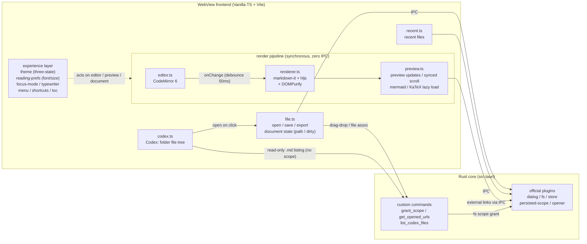

# Plume 🪶

[](LICENSE)
[](https://tauri.app/)
[](https://www.typescriptlang.org/)
[](https://codemirror.net/)

[中文](README.md)

A desktop Markdown tool that opens straight into reading and gets out of the way when you write. Other people's `.md` files render into a full-width reading view; your own get a focus mode, typewriter scrolling, KaTeX math, and mermaid diagrams. A native Tauri 2 app — light, no account, no plugin ecosystem.

<p align="center">
  
</p>

## Features

Plume splits reading and writing into three modes — Compose (immersive writing), Split (write against the preview), Read (immersive reading): files open into Read, you switch to Compose when you pick up the pen, and Split is there when you want the preview alongside. Reading and writing as equals — both done properly.

### Reading

| Feature | What it does |
|---------|--------------|
| **Three-way switch (Compose / Split / Read)** | A segmented toolbar control: Compose hides the preview and centers the editor; Split is the side-by-side panes; Read is full-width reading (preview centered at 800px). Existing files open in Read, new files in Compose, and Cmd/Ctrl+E jumps to Compose |
| **Table of contents** | In read mode, click "目錄" to open a sidebar TOC listing h1–h6 headings with hierarchical indentation. Click any heading to scroll to it; updates automatically on each edit |
| **Fullscreen reading** | Hides the toolbar and status bar, leaving just content and scrolling. Exit with the ✕ button at top-right or Escape; the TOC stays usable |
| **Drag & drop / folders** | Drop a `.md` to open it; drop a folder to auto-discover and open its README.md — toss a project folder onto Plume and see its README instantly |
| **File association** | Right-click a `.md` in Finder → Open With → Plume, or make Plume the default. Double-clicking another `.md` while Plume is running loads it in the same window |
| **Recent files** | Last 10 files survive restarts, file-access permissions included |
| **Codex (folders)** | Open a whole folder as a "Codex": the sidebar lists every `.md` underneath in a nested tree — click to open, mount several codices at once and switch via a dropdown, with each switch re-listing to reflect changes on disk. Read-only browsing — creating/deleting/renaming is left to your file manager; the app never takes directory write access. Open it from the toolbar "冊" button or File ▸ Open Codex Folder |

### Writing

| Feature | What it does |
|---------|--------------|
| **CodeMirror 6 editor** | Line numbers, Markdown syntax highlighting, search & replace, undo/redo; CJK input methods tested — composition never breaks mid-character |
| **Live preview** | In Split, the preview updates within 50ms of typing |
| **Focus mode** `⌘⇧F` | Only the paragraph under the cursor stays fully visible; the rest fades out. Paragraph boundaries follow blank lines and track the cursor as it moves; available in Compose only |
| **Typewriter mode** `⌘T` | The cursor line stays pinned to the vertical center of the screen while text scrolls up; even the top of the document can be centered — a Compose-only tool |
| **Copy as HTML** `⌘⇧C` | Renders the Markdown to HTML on the clipboard, ready to paste into a CMS or blog's HTML editor; math is converted to MathML automatically |
| **HTML export** | Produces a single self-styled `.html` that renders exactly like the preview |

### Rendering

| Feature | What it does |
|---------|--------------|
| **GFM** | Tables, task lists, strikethrough, autolinks — out of the box |
| **Code highlighting** | highlight.js with a curated 16-language subset (JS/TS/Python/Rust/Go/Java/C/C++/Bash/JSON/YAML/SQL/HTML/CSS/Markdown/diff), no auto-detection, no payload tax for languages you never use |
| **Mermaid diagrams** | ` ```mermaid ` blocks render live as SVG — flowchart, sequence, class, ER, Gantt and more, with theme-matched colors (lazy-loaded; files without diagrams pay nothing) |
| **KaTeX math** | Inline `$...$` and display `$$...$$` math, lazy-loaded — files without math never load KaTeX |
| **Footnotes** | `[^1]` footnote syntax, with a footnote section auto-generated at the bottom of the preview and click-to-jump references |
| **Front matter hiding** | YAML front matter (fenced by `---`) never shows up in the preview |
| **Safe rendering** | Every render passes through DOMPurify — opening someone else's `.md` with a stray `<script>` is a non-event |

### Personalization

| Feature | What it does |
|---------|--------------|
| **Three-state theme** | Vol de Nuit (dark, default), Inkstone (light), and Auto (follows the system light/dark setting); your choice is remembered across restarts |
| **Reading font** | Default / Serif / Sans / Mono, with `⌘=` / `⌘-` / `⌘0` to adjust the size live (12–24px) |
| **Native menu bar** | Plume / File / Edit / View / Help system-native menus |
| **Shortcut cheat sheet** | `⌘/` brings up an overlay; key labels adapt to the platform (macOS `⌘` / Windows `Ctrl`) |

## Architecture



**Design principle:** reading and writing as equals — files open into full-width reading (Read), picking up the pen switches to immersive writing (Compose), with Split in between for writing against the preview. Focus, typewriter, and live preview are all there in the writing modes. The entire Markdown pipeline stays in the frontend (synchronous, zero IPC, zero race conditions), with mermaid and KaTeX as lazy-loaded post-processing. Wrapped around that spine is an experience layer (theme, font, focus/typewriter, menu, TOC, Codex) that changes presentation without touching the data flow. Rust handles file I/O, dialogs, OS integration, and three custom commands: `grant_scope` (per-file fs-scope authorization for drag-drop and file-association paths, with symlink resolution and extension validation; also handles folder drops by discovering README.md), `get_opened_urls` (cold-start file paths from the OS), and `list_codex_files` (a read-only recursive listing of a Codex folder's `.md` files — returns paths only and never opens a directory fs scope; "can list a directory" is not "can read its contents," so clicking a file still goes through per-file `grant_scope` and the load-bearing wall stays intact).

## Tech stack

| Tech | Version | Role |
|------|---------|------|
| Tauri | 2.x | Desktop shell (Rust core + system WebView) |
| TypeScript + Vite | TS 5.x / Vite 6 | Frontend language and build tooling, zero UI framework |
| CodeMirror | 6 (`codemirror` meta package + `@codemirror/lang-markdown`) | Editor: line numbers, Markdown highlighting, search & replace, IME support |
| markdown-it | 14.x | Markdown → HTML (GFM: tables and strikethrough built in, linkify on) |
| markdown-it-task-lists | 2.x | GFM task-list checkboxes |
| markdown-it-footnote | 4.x | `[^1]` footnote syntax |
| highlight.js | 11.x | Code block highlighting (curated 16-language subset only) |
| KaTeX | 0.17.x | Math rendering (lazy-loaded, `trust: false` + `maxSize: 20`) |
| mermaid | 11.x | Diagram rendering (lazy-loaded, `securityLevel: "strict"`) |
| DOMPurify | 3.x | XSS sanitization of rendered output (non-negotiable, see SPEC) |
| Tauri Plugins | 2.x | dialog / fs / store / persisted-scope / opener |
| Vitest | 4.x | Unit tests (65 of them, rendering pipeline and Codex tree-building) |

> Front matter hiding uses a regex strip ahead of `render()` rather than `markdown-it-front-matter` — that package has an edge case where a document starting with `---` but never closing it gets swallowed whole.

## Installation

### Download

Grab the installer for your platform from [Releases](https://github.com/tznthou/plume/releases):

| Platform | File |
|----------|------|
| macOS (Apple Silicon) | `Plume_x.y.z_aarch64.dmg` |
| macOS (Intel) | `Plume_x.y.z_x64.dmg` |
| Windows x64 | `Plume_x.y.z_x64-setup.exe` (NSIS) or `Plume_x.y.z_x64_en-US.msi` |

> **First launch on macOS:** the app isn't notarized (personal tool, no paid certificate), so Gatekeeper will balk. Right-click Plume.app → "Open" and confirm once, or run `xattr -cr /Applications/Plume.app`.
>
> **Windows:** packaged by CI but not fully field-tested (IME behavior, file dialogs). Open an issue if something breaks.

### Build from source

Prerequisites:

- macOS 13+ (verified dev setup: rustc 1.88 / Node 22 / Xcode CLT)
- Rust toolchain (`rustup`)
- Node.js 22+ and npm

```bash
git clone https://github.com/tznthou/plume.git && cd plume
npm install
npm run tauri dev     # dev window with hot reload
npm run tauri build   # bundles .app into src-tauri/target/release/bundle/
npm run test          # Vitest unit tests
```

> The release profile enables LTO + strip + codegen-units 1 + panic abort, bringing the packaged binary down to ~4.9 MB.

## Project layout

```
markdown-tool/
├── index.html              # layout skeleton: toolbar + Compose/Split/Read modes + Codex sidebar
├── src/                    # frontend (Vanilla TS)
│   ├── main.ts             # entry point: module wiring, mode switching
│   ├── editor.ts           # CodeMirror 6 wrapper
│   ├── renderer.ts         # markdown-it + hljs + DOMPurify pipeline (incl. KaTeX parse rules)
│   ├── preview.ts          # preview updates, synced scroll, external links, mermaid/KaTeX lazy render
│   ├── toc.ts              # table of contents: heading extraction + click-to-scroll
│   ├── file.ts             # open/save/save-as/HTML export, document state (path, dirty)
│   ├── recent.ts           # recent files (plugin-store)
│   ├── codex.ts            # Codex: read-only folder listing + nested file tree + multi-codex switching
│   ├── theme.ts            # three-state theme (Vol de Nuit/Inkstone/Auto), matchMedia listener
│   ├── reading-prefs.ts    # reading font & size preferences (plugin-store persisted)
│   ├── focus-mode.ts       # focus mode: spotlight the cursor's paragraph, fade the rest
│   ├── typewriter.ts       # typewriter mode: pin the cursor line to screen center
│   ├── menu.ts             # native menu bar (@tauri-apps/api/menu, built in JS)
│   ├── shortcuts.ts        # keyboard shortcut overlay (cheat sheet)
│   ├── statusbar.ts        # status bar: word/line count, render time, unsaved indicator
│   └── style.css           # layout + dual themes + Compose/Split/Read modes + preview typography
├── src-tauri/              # Rust core
│   ├── src/lib.rs          # Tauri bootstrap + plugins + custom commands
│   ├── capabilities/       # IPC permission declarations (least privilege)
│   ├── permissions/        # auto-generated command ACLs
│   └── tauri.conf.json     # window, CSP, bundle, file association config
├── tests/                  # Vitest tests
├── docs/                   # specs (written in Chinese)
│   ├── PRD.md              # requirements and user stories
│   ├── SPEC.md             # architecture, module boundaries, IPC, security
│   └── PLAN.md             # roadmap and smoke checklist
├── CHANGELOG.md            # version history (Chinese; CHANGELOG_EN.md alongside)
├── LICENSE                 # Apache 2.0
├── README.md               # Chinese README
└── README_EN.md            # this file
```

See the [CHANGELOG](CHANGELOG_EN.md) for the version history.

---

## Reflections

### Why this exists

I read and write far more Markdown than I ever signed up for. That's an AI-era thing: model output, project docs, technical notes — these days it all arrives as `.md`. Markdown used to live inside Obsidian for me, conceptually no different from plain text. Now it's a daily format.

The catch is that Markdown never shows you its rendered self. Tables, task lists, and code blocks only take shape once rendered — unlike a Word document, which opens already laid out. So every time I wanted to read a single `.md`, the routine was: spin up an Obsidian vault, hand it to a browser extension, or push to GitHub just to see how it looks. A long detour for "let me read this."

So I made my own: opens straight to reading, one keystroke into editing, no vault, no account, no plugin ecosystem. Even the name was deliberate — plume, the French word for a feather, and for the quill you write with. Light — for reading, and for writing with care.

### Why a reader should also be good to write in

It started as just a reader. But since opening a file already meant I could edit it, editing couldn't be an afterthought. Writing long pieces, a screen full of paragraphs pulls your attention everywhere — so there's a focus mode, where only the paragraph under the cursor stays lit and the rest dims. Typing downward, your eyes have to chase the cursor toward the bottom of the screen — so there's a typewriter mode, where the cursor line is pinned to the center and text scrolls up past it. And when a piece is done and needs to go somewhere else, there's copy-as-HTML, math converted to MathML and all.

These are lessons from immersive writing tools like Byword. Plume tries to put "instantly readable" and "good to write in" in the same window — for reading other people's, and writing your own.

---

## Merch concepts

The fox from the Vol de Nuit theme escaped the app and landed on a phone case, a mousepad, and a sticker sheet.

<p align="center">
  
  
  
</p>

---

## License

This project is licensed under [Apache 2.0](LICENSE).

## Author

tznthou - [tznthou@gmail.com](mailto:tznthou@gmail.com)
