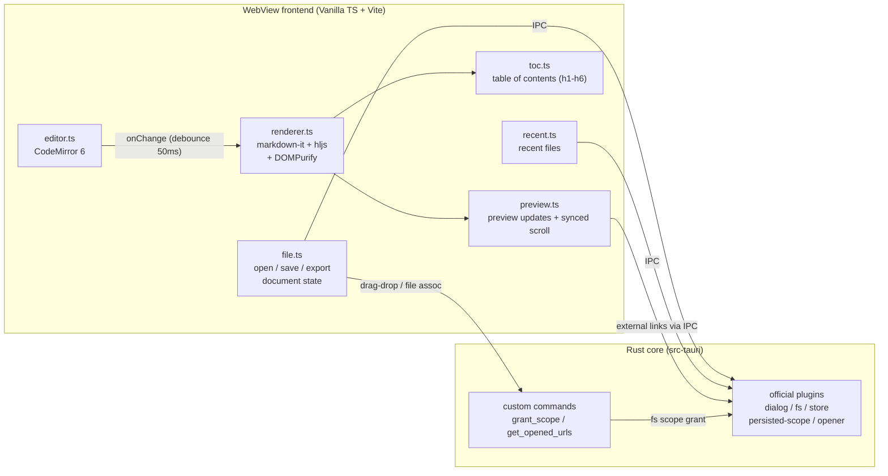

# Plume 🪶

[](LICENSE)
[](https://tauri.app/)
[](https://www.typescriptlang.org/)
[](https://codemirror.net/)

[中文](README.md)

A lightweight Markdown reader — files open straight into full-width rendered view; editing is one click away when you need it. Tauri 2 desktop app that gets you from `.md` to reading without the detour.

<p align="center">
  
</p>

## Features

| Feature | What it does |
|---------|--------------|
| **Read mode by default** | Files open in full-width reading view (preview centered at 800px). Click "編輯" or Cmd/Ctrl+E to switch to split-pane editing; new files go straight to edit mode |
| **Table of Contents** | In read mode, click "目錄" to open a sidebar TOC listing h1–h6 headings with hierarchical indentation. Click any heading to scroll to it; updates automatically on each edit |
| **Fullscreen reading** | Hides the toolbar and status bar, leaving just content and scrolling. Exit with the ✕ button at top-right or Escape; TOC remains usable |
| **Drag & drop / folders** | Drop a `.md` to open it; drop a folder to auto-discover and open its README.md — toss a project folder onto Plume and see its README instantly |
| **File association** | Right-click a `.md` in Finder → Open With → Plume, or make Plume the default. Double-clicking another `.md` while Plume is running loads it in the same window |
| **Live preview** | In edit mode, updates within 50ms of typing; GFM tables, task lists, strikethrough, autolinks |
| **Editor** | CodeMirror 6: line numbers, Markdown syntax highlighting, search & replace, undo/redo; CJK input methods tested — composition never breaks mid-character |
| **Code highlighting** | highlight.js with a curated language subset — no payload tax for languages you never use |
| **Safe rendering** | Every render passes through DOMPurify — opening someone else's `.md` with a stray `<script>` is a non-event |
| **HTML export** | Produces a single self-styled `.html` that renders exactly like the preview |
| **Recent files** | Last 10 files survive restarts, file-access permissions included |
| **Shortcuts** | Cmd/Ctrl + N new, O open, S save, Shift+S save-as, E toggle read/edit; closing with unsaved changes prompts first |

## Architecture



**Design principle:** read first, edit on demand — files open into full-width reading view; editing is a deliberate switch, not the default. The entire Markdown pipeline stays in the frontend (synchronous, zero IPC, zero race conditions). Rust handles file I/O, dialogs, OS integration, and two custom commands: `grant_scope` (per-file fs-scope authorization for drag-drop and file-association paths, with symlink resolution and extension validation; also handles folder drops by discovering README.md) and `get_opened_urls` (cold-start file paths from the OS).

## Tech stack

| Tech | Version | Role |
|------|---------|------|
| Tauri | 2.x | Desktop shell (Rust core + system WebView) |
| TypeScript + Vite | TS 5.x / Vite (via create-tauri-app) | Frontend language and build tooling, zero UI framework |
| CodeMirror | 6 (`codemirror` meta package + `@codemirror/lang-markdown`) | Editor: line numbers, Markdown highlighting, search & replace, IME support |
| markdown-it | 14.x | Markdown → HTML (GFM: tables and strikethrough built in, linkify on) |
| markdown-it-task-lists | 2.x | GFM task-list checkboxes |
| highlight.js | 11.x | Code block highlighting (curated language subset only) |
| DOMPurify | 3.x | XSS sanitization of rendered output (non-negotiable, see SPEC) |
| Tauri Plugins | 2.x | dialog / fs / store / persisted-scope / opener |
| Vitest | 3.x | Unit tests (rendering pipeline focus) |

## Installation

### Download

Grab the installer for your platform from [Releases](https://github.com/tznthou/plume/releases):

| Platform | File |
|----------|------|
| macOS (Apple Silicon) | `Plume_x.y.z_aarch64.dmg` |
| macOS (Intel) | `Plume_x.y.z_x64.dmg` |
| Windows x64 | `Plume_x.y.z_x64-setup.exe` (NSIS) or `Plume_x.y.z_x64_en-US.msi` |

> **First launch on macOS:** the app isn't notarized (personal tool, no paid certificate), so Gatekeeper will balk. Right-click Plume.app → "Open" and confirm once, or run `xattr -cr /Applications/Plume.app`.
>
> **Windows:** packaged by CI but not fully field-tested (IME behavior, file dialogs). Open an issue if something breaks.

### Build from source

Prerequisites:

- macOS 13+ (verified dev setup: rustc 1.88 / Node 22 / Xcode CLT)
- Rust toolchain (`rustup`)
- Node.js 22+ and npm

```bash
git clone https://github.com/tznthou/plume.git && cd plume
npm install
npm run tauri dev     # dev window with hot reload
npm run tauri build   # bundles .app into src-tauri/target/release/bundle/
npm run test          # Vitest unit tests
```

## Project layout

```
markdown-tool/
├── index.html              # layout skeleton: toolbar + read/edit dual mode
├── src/                    # frontend (Vanilla TS)
│   ├── main.ts             # entry point: module wiring, mode switching, shortcuts
│   ├── editor.ts           # CodeMirror 6 wrapper
│   ├── renderer.ts         # markdown-it + hljs + DOMPurify pipeline
│   ├── preview.ts          # preview updates, synced scroll, external link handling
│   ├── toc.ts              # table of contents: heading extraction + click-to-scroll
│   ├── file.ts             # open/save/save-as/HTML export, document state (path, dirty)
│   ├── recent.ts           # recent files (plugin-store)
│   └── style.css           # layout + dual themes + read/edit modes + preview typography
├── src-tauri/              # Rust core
│   ├── src/lib.rs          # Tauri bootstrap + plugins + custom commands
│   ├── capabilities/       # IPC permission declarations (least privilege)
│   ├── permissions/        # auto-generated command ACLs
│   └── tauri.conf.json     # window, CSP, bundle, file association config
├── tests/                  # Vitest tests
├── docs/                   # specs (written in Chinese)
│   ├── PRD.md              # requirements and user stories
│   ├── SPEC.md             # architecture, module boundaries, IPC, security
│   └── PLAN.md             # roadmap and smoke checklist
├── LICENSE                 # Apache 2.0
├── README.md               # Chinese README
└── README_EN.md            # this file
```

---

## Reflections

### Why this exists

I read and write far more Markdown than I ever signed up for. That's an AI-era thing: model output, project docs, technical notes — these days it all arrives as `.md`. Markdown used to live inside Obsidian for me, conceptually no different from plain text. Now it's a daily format.

The catch is that Markdown never shows you its rendered self. Tables, task lists, and code blocks only take shape once rendered — unlike a Word document, which opens already laid out. So every time I wanted to read a single `.md`, the routine was: spin up an Obsidian vault, hand it to a browser extension, or push to GitHub just to see how it looks. A long detour for "let me read this."

So I made my own: opens instantly, previews as you type, saves and steps aside. No vault, no account, no plugin ecosystem. Even the name was deliberate — plume, the French word for a feather, and for the quill you write with. Light — for reading, and for writing with care.

---

## Merch Concepts

The fox from the Vol de Nuit theme escaped the app and landed on a phone case, a mousepad, and a sticker sheet.

<p align="center">
  
  
  
</p>

---

## License

This project is licensed under [Apache 2.0](LICENSE).

## Author

tznthou - [tznthou@gmail.com](mailto:tznthou@gmail.com)
