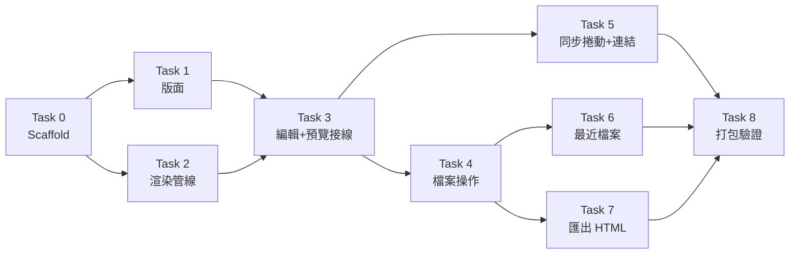

# Plume — 實作路線圖（PLAN）

## 實作策略

### Build Order

基礎層 → 核心渲染 → 編輯整合 → 檔案層 → 體驗層 → 打包驗證。
渲染管線（Task 2）先於編輯器整合（Task 3），因為它是純函式、可獨立測試，是品質基石。



Task 2 與 Task 1 可平行；Task 5/6/7 在 Task 4 後可平行。

### 測試策略

- 框架選型：Vitest（jsdom 環境）
- 覆蓋率目標：`renderer.ts` 行覆蓋 ≥ 90%（核心純函式）；UI 膠水層不設硬指標，靠冒煙清單
- 命名慣例：`test_<模組>_<功能>_<情境>_<預期>`
- Tauri IPC 在單元測試中 mock（`@tauri-apps/api` mocks）；不建 WebDriver E2E（小型應用成本不划算），整合行為靠冒煙清單人工驗證

### 風險與回退

| 風險 | 預警驗證點 | 回退方案 |
|------|-----------|----------|
| CM6 中文 IME 組字異常 | Task 3 完成即手動測注音輸入 | 降級純 textarea（損失行號/高亮，保留其餘功能） |
| persisted-scope 跨 session 授權失效 | Task 6 驗收必含「重啟後開啟」 | 最近檔案降級為僅當次 session 有效 |
| highlight.js bundle 過大 | Task 2 完成看 `npm run build` 體積 | 再裁語言子集或換 CSS-only 方案 |

---

## Task 清單

### Task 0: 專案 Scaffold 與工具鏈

**目標**：可啟動的 Tauri 2 + Vanilla TS 空殼，依賴與權限就緒。

**影響範圍**：
- Create: 整個 scaffold（`create-tauri-app` vanilla-ts 模板）。**注意**：目錄已有 README / CLAUDE.md / docs/，`create-tauri-app` 不接受非空目錄——先 scaffold 至暫存目錄再合併產出進來，既有文件一律保留、不可覆寫或刪除
- 既存: `.gitignore` 已於規劃階段建立（2026-06-11，含 `.claude/`、`node_modules/`、`src-tauri/target/`、`dist/` 等）——scaffold 合併時保留此檔，不可被模板自帶的 .gitignore 覆蓋
- Modify: `package.json`（加入 codemirror、@codemirror/lang-markdown、markdown-it、markdown-it-task-lists、highlight.js、dompurify、vitest 及 @types）
- Modify: `src-tauri/Cargo.toml` + `src-tauri/src/lib.rs`（註冊 dialog/fs/store/persisted-scope/opener 五個 plugin）
- Create: `src-tauri/capabilities/default.json`（SPEC「IPC 邊界與權限」表的最小權限集）
- 執行: `git init` + 首次 commit

**依賴**：無

**驗收條件**：
- Given 全新 clone → When `npm install && npm run tauri dev` → Then 開出應用視窗無錯誤
- Given dev 視窗 → When 以臨時程式碼執行 `dialog.open()` 選一個 `.md` → Then `readTextFile()` 成功讀出內容（**IPC 承重牆 spike**：驗證「dialog 授權路徑 → fs scope」鏈路，這是 Task 4/6 的前提假設）
- Given repo → When `git status` → Then `.claude/`、`target/`、`node_modules/` 不被追蹤

**完成信號**：dev 視窗啟動 + IPC spike 走通（驗證後移除 SPEC 中的待驗證標記）+ `npm run test` 跑得動（空測試通過）

---

### Task 1: 版面骨架

**目標**：工具列 + 左右分割的靜態版面。

**影響範圍**：
- Modify: `index.html`（toolbar：新增/開啟/儲存/匯出/最近檔案下拉；main：`#editor` + `#preview` 左右各半）
- Create: `src/style.css`（flexbox 分割、預覽區 GitHub 風 typography、hljs 主題引入）

**依賴**：Task 0

**驗收條件**：
- Given dev 視窗 → When 啟動 → Then 呈現工具列與左右分割區（按鈕尚無功能）

**完成信號**：視窗版面與設計一致，無 console 錯誤

---

### Task 2: 渲染管線（核心純函式）

**目標**：`render(md: string): string` —— GFM + 高亮 + 消毒，一次到位。

**影響範圍**：
- Create: `src/renderer.ts`（markdown-it 設定見 SPEC「渲染管線規格」；hljs 語言子集註冊；DOMPurify 收尾）
- Test: `tests/renderer.test.ts`

**依賴**：Task 0（可與 Task 1 平行）

**驗收條件**：
- Given GFM 語法（表格/任務清單/刪除線/裸網址） → When `render()` → Then 輸出對應 HTML 結構
- Given 含 ` ```ts ` fence 的 md → When `render()` → Then `<code>` 帶 hljs 高亮 class
- Given 含 `<script>` 或 `` 的 md → When `render()` → Then 惡意碼不存在於輸出

**測試設計**：
- 正常：`test_renderer_render_gfmTable_outputsTableTag`
- 正常：`test_renderer_render_taskList_outputsCheckbox`
- 正常：`test_renderer_render_fencedCodeTs_hasHljsClass`
- 正常：`test_renderer_render_bareUrl_autolinks`
- 邊界：`test_renderer_render_emptyString_returnsEmpty`
- 邊界：`test_renderer_render_unknownLang_fallsBackPlaintext`
- 邊界：`test_renderer_render_scriptTag_stripped`
- 邊界：`test_renderer_render_imgOnerror_attributeStripped`

**完成信號**：所有測試通過 + `renderer.ts` 覆蓋率 ≥ 90%

---

### Task 3: 編輯器與即時預覽接線

**目標**：CM6 編輯器上線，打字即渲染。

**影響範圍**：
- Create: `src/editor.ts`（EditorView：行號、lang-markdown、`onChange` 回呼）
- Create: `src/preview.ts`（`update(html)` 更新 `#preview`）
- Create: `src/main.ts`（組裝：editor onChange → debounce 50ms → render → preview）

**依賴**：Task 1 + Task 2

**驗收條件**：
- Given dev 視窗 → When 輸入 GFM 內容 → Then 預覽 200ms 內更新（US-1）
- Given 注音輸入法 → When 組字中 → Then 不中斷、不跳字（手動驗證）

**測試設計**：無單元測試——debounce 與接線屬膠水層，邏輯壞了冒煙清單「輸入即時渲染」立即翻紅，單測只會重複測 setTimeout

**完成信號**：手動輸入 GFM 即時渲染正確 + 中文 IME 驗證過（風險表預警點）

---

### Task 4: 檔案操作與狀態

**目標**：開/存/另存/新增 + dirty 生命週期完整。

**影響範圍**：
- Create: `src/file.ts`（openFile/saveFile/saveAs/newFile；`DocState`（path/dirty）一併維護於此，見 SPEC 資料模型；視窗標題 `檔名 ●`）
- Modify: `src/main.ts`（快捷鍵 Cmd+N/O/S/Shift+S；`onCloseRequested` dirty 攔截）
- Test: `tests/file.test.ts`（mock Tauri API）

**依賴**：Task 3

**驗收條件**：
- Given 選定 `.md` → When Cmd+O → Then 內容入編輯區、標題顯檔名（US-2）
- Given dirty 文件 → When 關閉視窗 → Then 確認對話框（儲存/放棄/取消）（US-2）
- Given 未命名文件 → When Cmd+S → Then 走另存流程（US-2）

**測試設計**：
- 正常：`test_file_open_validPath_loadsContentAndSetsPath`
- 正常：`test_file_save_dirtyDoc_writesAndClearsDirty`
- 邊界：`test_file_save_noPath_delegatesToSaveAs`
- 邊界：`test_file_open_readFails_keepsCurrentDoc`

**完成信號**：測試通過 + 手動開→改→存→重開內容一致

---

### Task 5: 同步捲動與外部連結

**目標**：編輯→預覽比例式跟捲；預覽連結走系統瀏覽器。

**影響範圍**：
- Modify: `src/preview.ts`（scroll listener 比例映射；`a[href^="http"]` click 攔截 → opener）

**依賴**：Task 3（可與 Task 4 平行驗證，正式排序在後）

**驗收條件**：
- Given 長文 → When 捲動編輯區 → Then 預覽按比例跟隨（US-4）
- Given 預覽含外部連結 → When 點擊 → Then 系統瀏覽器開啟、webview 不導航（F-08）

**測試設計**：無單元測試——捲動比例映射在 jsdom 需 mock 全部尺寸屬性，測的是 mock 不是行為；由冒煙清單覆蓋

**完成信號**：手動長文捲動順暢無抖動 + 點外部連結開系統瀏覽器

---

### Task 6: 最近開啟檔案

**目標**：最近 10 筆跨 session 可用。

**影響範圍**：
- Create: `src/recent.ts`（store 讀寫、去重、上限 10、失效移除）
- Modify: `src/file.ts`（open/saveAs 成功後記錄）
- Modify: `index.html` + `src/main.ts`（工具列下拉清單）
- Test: `tests/recent.test.ts`（mock store）

**依賴**：Task 4

**驗收條件**：
- Given 開過 N 檔 → When 看下拉 → Then 新→舊最多 10 筆（US-6）
- Given app 重啟 → When 點最近檔案 → Then 直接開啟成功（US-6，persisted-scope 驗證點）
- Given 檔案已刪 → When 點擊 → Then 非阻斷提示 + 自清單移除（US-6）

**測試設計**：
- 正常：`test_recent_add_newPath_prependsAndDedupes`
- 邊界：`test_recent_add_eleventhItem_dropsOldest`
- 邊界：`test_recent_open_missingFile_removesEntry`

**完成信號**：測試通過 + **重啟 app 實測**最近檔案可開（風險表預警點）

---

### Task 7: 匯出 HTML

**目標**：一鍵產出自帶樣式的獨立 HTML。

**影響範圍**：
- Modify: `src/file.ts`（`exportHtml()`：HTML 外殼模板（內嵌 typography/hljs CSS）組裝 → save dialog → 寫檔；模板為字串常數，不另開檔案）
- Test: `tests/export.test.ts`

**依賴**：Task 4

**驗收條件**：
- Given 編輯區有內容 → When 匯出 → Then `.html` 在瀏覽器渲染與預覽一致、無外部資源請求（US-5）

**測試設計**：
- 正常：`test_export_buildHtml_containsRenderedBodyAndInlineCss`
- 邊界：`test_export_buildHtml_outputPassedThroughSanitizer`

**完成信號**：測試通過 + 匯出檔離線開啟正常

---

### Task 8: 打包與收尾驗證

**目標**：產出 `.app`，MVP 完成定義達成。

**影響範圍**：
- Modify: `src-tauri/tauri.conf.json`（CSP 按 SPEC 安全規格、視窗預設尺寸、bundle identifier）
- 執行: `npm run tauri build` + 冒煙清單全跑

**依賴**：Task 5 + 6 + 7

**驗收條件**：
- Given release build → When 安裝執行 `.app` → Then 冒煙清單全過

**完成信號**：冒煙清單 9 項全勾 + bundle < 15MB

---

### Task 9: 拖曳開檔

**目標**：拖曳 `.md` 到視窗即可開啟。

**影響範圍**：
- Modify: `src-tauri/src/lib.rs`（加 `grant_scope` command 授權外部路徑 fs scope）
- Modify: `src-tauri/build.rs`（`AppManifest` 宣告 command 以自動生成 ACL）
- Modify: `src-tauri/capabilities/default.json`（加 `allow-grant-scope`）
- Modify: `src/file.ts`（加 `openExternal()`：grant scope → dirty check → loadPath）
- Modify: `src/main.ts`（`onDragDropEvent` 監聽 + drag-hover class 切換）
- Modify: `src/style.css`（`body.drag-hover` 視覺回饋）
- Test: `tests/file.test.ts`（openExternal 三測試）

**依賴**：Task 4（檔案操作與狀態）

**驗收條件**：
- Given `.md` 檔 → When 拖入視窗 → Then 檔案開啟、標題更新
- Given `.txt` 檔 → When 拖入視窗 → Then 無反應
- Given dirty 文件 → When 拖入 `.md` → Then 出現儲存確認對話框
- Given 拖曳中 → When 檔案懸停於視窗 → Then 出現視覺回饋（accent 色邊框）

**測試設計**：
- 正常：`test_file_openExternal_validMd_grantsAndLoads`
- 邊界：`test_file_openExternal_dirty_confirmsFirst`
- 邊界：`test_file_openExternal_scopeFails_showsError`

**完成信號**：測試通過 + 手動拖 .md 能開

---

### Task 10: 檔案關聯

**目標**：在 Finder/Explorer 雙擊 `.md` 以 Plume 開啟。

**影響範圍**：
- Modify: `src-tauri/tauri.conf.json`（`bundle.fileAssociations` 註冊 .md/.markdown）
- Modify: `src-tauri/src/lib.rs`（`RunEvent::Opened` macOS handler + Windows `std::env::args` fallback + `get_opened_urls` command）
- Modify: `src-tauri/capabilities/default.json`（加 `allow-get-opened-urls`）
- Modify: `src/main.ts`（cold-start `invoke` + warm-start `listen("file-open")`)

**依賴**：Task 9（共用 `grant_scope` command 和 `openExternal`）

**驗收條件**：
- Given `.app` 已安裝 → When Finder 右鍵 `.md` → 以 Plume 打開 → Then 檔案開啟
- Given Plume 未執行 → When 雙擊 `.md`（cold-start） → Then Plume 啟動並開啟該檔
- Given Plume 執行中 → When 雙擊另一個 `.md`（warm-start） → Then 開啟新檔，dirty check 正常

**完成信號**：build → 安裝 → 雙擊 .md 開啟

---

## 驗證計畫

### 冒煙測試清單（< 5 分鐘）

- [ ] 冷啟動 < 1.5s，視窗正常呈現
- [ ] 輸入 GFM（表格+任務清單+刪除線）即時渲染正確
- [ ] ` ```rust ` fence 程式碼高亮
- [ ] 注音輸入組字正常
- [ ] 開 `.md` → 編輯 → Cmd+S → 重開內容一致
- [ ] dirty 狀態關閉視窗有攔截
- [ ] 編輯區捲動，預覽跟隨
- [ ] 重啟後最近檔案可直接開啟
- [ ] 貼入 `<script>alert(1)</script>` 與 `` 不執行；預覽點外部連結開系統瀏覽器
- [ ] 拖 `.md` 到視窗 → 開檔、標題更新；拖 `.txt` → 無反應
- [ ] 拖曳懸停時視覺回饋（accent 色邊框），離開/放下後消失
- [ ] dirty 狀態下拖入 `.md` → 確認對話框正常
- [ ] Finder 雙擊 `.md`（cold-start）→ Plume 啟動並開檔
- [ ] Plume 執行中雙擊另一 `.md`（warm-start）→ 開檔 + dirty check
