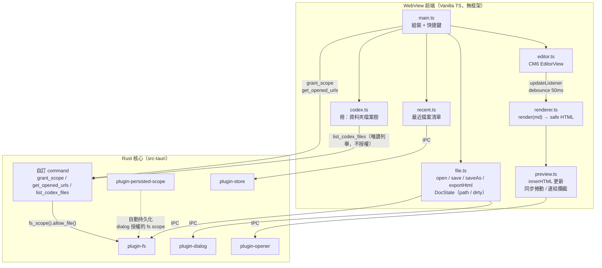

# Plume — 技術規格（SPEC）

## 系統架構



## 模組職責

| 模組 | 職責 | 依賴 |
|------|------|------|
| `src/main.ts` | 進入點：初始化各模組、註冊快捷鍵（Cmd+N/O/S/Shift+S）、關閉攔截 | editor, file, recent, preview |
| `src/editor.ts` | 封裝 CM6：建立 EditorView（行號、lang-markdown、基礎快捷鍵）、提供 `getContent()` / `setContent()` / `onChange(cb)` | codemirror |
| `src/renderer.ts` | **純函式** `render(md: string): string`：markdown-it（GFM + linkify + task-lists）→ highlight.js → DOMPurify | markdown-it, hljs, dompurify |
| `src/preview.ts` | 接收 HTML 更新預覽 DOM、同步捲動（編輯→預覽單向比例式）、攔截 `a[href^="http"]` 點擊改走 opener、mermaid 圖表懶載入渲染（`securityLevel: 'strict'`，雙主題同步） | renderer 輸出, plugin-opener, mermaid（動態 import） |
| `src/file.ts` | 開/存/另存/新增/匯出 HTML/外部路徑開檔（`openExternal`）；dirty 確認流程；維護 `DocState`（path/dirty）；更新視窗標題（`檔名 ●`）。內容唯一真相來源是 CM6 EditorState，**不另存字串副本** | plugin-dialog, plugin-fs, core(invoke) |
| `src/recent.ts` | 最近 10 筆（去重、新→舊）；讀寫 store；失效項移除 | plugin-store, file |
| `src/codex.ts` | 冊（Codex）：開資料夾為冊、Rust 唯讀列舉 `.md` 建巢狀樹、點檔走 `openExternal`、多冊切換、`codex.json` 持久化（只存根路徑，每次重列舉） | plugin-dialog, plugin-store, core(invoke), file |
| `src-tauri/src/lib.rs` | Tauri builder：註冊五個官方 plugin + 三個自訂 command（`grant_scope` / `get_opened_urls` / `list_codex_files`）；`RunEvent::Opened` 檔案關聯處理 | tauri plugins, tauri-plugin-fs(FsExt) |

## IPC 邊界與權限（capabilities）

原則：**渲染零 IPC、檔案全 IPC、權限最小化**。

| 操作 | 前端 API | Capability 權限 |
|------|----------|----------------|
| 開檔對話框 | `plugin-dialog` `open()` | `dialog:allow-open` |
| 存檔對話框 | `plugin-dialog` `save()` | `dialog:allow-save` |
| 訊息/確認框 | `plugin-dialog` `ask()/message()` | `dialog:allow-ask`, `dialog:allow-message` |
| 讀文字檔 | `plugin-fs` `readTextFile()` | `fs:allow-read-text-file`（scope 僅 dialog 授權路徑） |
| 寫文字檔 | `plugin-fs` `writeTextFile()` | `fs:allow-write-text-file`（同上） |
| 最近檔案持久化 | `plugin-store` | `store:default` |
| 跨 session 路徑授權 | `plugin-persisted-scope` | （自動，無前端 API） |
| 外開連結 | `plugin-opener` `openUrl()` | `opener:allow-open-url` |
| 關閉攔截／視窗標題 | `onCloseRequested()` / `destroy()` / `setTitle()` | `core:window:allow-close`, `core:window:allow-destroy`, `core:window:allow-set-title`（dirty 攔截確認後以 `destroy()` 關閉，避免 `close()` 重觸發事件） |
| 外部路徑授權 fs scope | `invoke("grant_scope", { path })` | `allow-grant-scope`（自訂 command；驗證 .md/.markdown 副檔名後呼叫 `fs_scope().allow_file()`） |
| 冷啟動檔案路徑取得 | `invoke("get_opened_urls")` | `allow-get-opened-urls`（自訂 command；回傳 OS 傳入的檔案路徑後清空暫存） |
| 冊資料夾唯讀列舉 | `invoke("list_codex_files", { root })` | `allow-list-codex-files`（自訂 command；遞迴列 `.md` 路徑，**不開目錄 fs scope**、skip symlink、深度上限 16） |
| 拖曳事件 | `getCurrentWebview().onDragDropEvent()` | 無額外權限（Tauri 2 core 內建） |
| 暖啟動檔案事件 | `listen("file-open")` | 無額外權限（`core:event:default` 已含 listen） |
| 原生選單列 | `@tauri-apps/api/menu`（JS 端建構） | `core:menu:default` |

關鍵機制：`plugin-fs` 預設 scope 不含使用者任意路徑；經 `plugin-dialog` 選取的路徑會被動態加入 fs scope，`plugin-persisted-scope` 再把這份授權跨 session 保存——這是「最近檔案重啟後仍可開」的依賴鏈，缺一不可。此鏈路已完整實測通過：前半段（dialog 授權 → fs scope → readTextFile）於 2026-06-11 Task 0 IPC spike 驗證；persisted-scope 跨 session 段於同日 Task 6 驗收驗證（重啟後不經 dialog 直開最近檔案成功）。

拖曳與檔案關聯的路徑不來自 dialog，改以自訂 command `grant_scope` 呼叫 Rust 端 `FsExt::fs_scope().allow_file()` 動態加入 scope（僅接受 .md/.markdown 副檔名）。此設計維持 capabilities 不開全域路徑的安全原則。

冊（Codex）的資料夾瀏覽以唯讀 command `list_codex_files` 遞迴列出 `.md` 路徑，純 Rust `std::fs::read_dir`（後端不受 Tauri fs scope 限制）、**完全不呼叫 fs scope 授權**——「能列目錄」與「能讀檔內容」分離，列舉不等於可讀。使用者點某個 `.md` 才沿用 `grant_scope` 單檔授權，per-file 承重牆零增量（決策 46 方案 B）。列舉端 skip symlink + 深度上限 16，避免回傳 scope 外捷徑路徑或迴圈。

## 渲染管線規格

```
md 字串 → markdown-it.render() → raw HTML → DOMPurify.sanitize() → 預覽 innerHTML
                                                                         ↓（含 mermaid block 時）
                                                               動態 import mermaid.js
                                                                         ↓
                                                               mermaid.run() → SVG
                                                                         ↓
                                                               cloneNode(true)（剝 event listener）
```

| 環節 | 設定 | 理由 |
|------|------|------|
| markdown-it preset | `default`（含 table、strikethrough） | GFM 表格/刪除線開箱即用 |
| `html: true` | 允許 inline HTML 進 parser | 技術文件常見 `` 等排版標籤；安全交給 DOMPurify 把關 |
| `linkify: true` | 裸網址自動成連結 | GFM autolink 行為 |
| 插件 | `markdown-it-task-lists` | GFM checkbox（渲染為 disabled checkbox） |
| highlight 回呼 | highlight.js，僅註冊子集：js/ts/python/rust/bash/json/yaml/html/css/sql/go/java/c/cpp/markdown/diff；`lang === "mermaid"` 時輸出 `<pre class="mermaid">` 容器交由 post-render 處理；未標注或未知語言 fallback plaintext，**不開自動偵測** | 控制 bundle 與渲染時間 |
| DOMPurify | 預設白名單（擋 `<script>`、event handler 屬性、`javascript:` URI） | 見安全章節 |
| mermaid（post-render） | 懶載入 `import("mermaid")`；`securityLevel: "strict"`（內部 DOMPurify + HTML encode）；theme 跟隨 app 主題（vol-de-nuit→dark / inkstone→default）；generation 計數器防 stale DOM 操作 | 閱讀器核心：別人的 `.md` 有 mermaid 圖要能看到 |

渲染觸發：CM6 `updateListener` → `docChanged` → debounce 50ms → `render()` → `preview.update()`。同步呼叫鏈，無 async、無 race。Mermaid 渲染為唯一 async 後處理步驟（懶載入 + `mermaid.run()`），不阻塞主渲染流程。（debounce 原定 150ms，2026-06-11 Task 3 驗收時依子超實際手感調為 50ms，注音組字驗證正常。）

## 資料模型

無資料庫。兩份輕量結構作為契約：

```typescript
// file.ts — 記憶體文件狀態
interface DocState {
  path: string | null;   // null = 未命名新文件
  dirty: boolean;        // 內容是否與磁碟不同步
}

// recent.json — plugin-store 持久化（app data 目錄）
interface RecentFile {
  path: string;          // 絕對路徑
  lastOpened: string;    // ISO 8601
}
interface RecentStore {
  files: RecentFile[];   // 最多 10 筆，新→舊，path 去重
}
```

匯出 HTML 格式契約：單一獨立檔 = `<!doctype html>` + `<style>`（內嵌預覽同款 typography + hljs 主題 CSS）+ 渲染後 body。無外部資源引用，離線可開。

## 安全規格

威脅模型：開啟**他人撰寫的** `.md`（US-3）。Tauri webview 內的 XSS 比瀏覽器危險——注入的 script 可呼叫前端已獲授權的 IPC API（讀寫檔案）。

| 防線 | 實作 |
|------|------|
| 輸出消毒 | 所有 `render()` 輸出必過 DOMPurify，預設白名單，此環節**不可被任何功能繞過**（含匯出 HTML）。Mermaid SVG 不經 DOMPurify 二次處理（foreignObject 衝突），安全靠 mermaid `securityLevel: "strict"`（內部 DOMPurify + HTML encode），post-render 用 `cloneNode(true)` 剝除 `addEventListener` 綁定 |
| CSP | `tauri.conf.json` 設定：`default-src 'self'; img-src 'self' asset: https: data:; style-src 'self' 'unsafe-inline' https://fonts.googleapis.com; font-src 'self' https://fonts.gstatic.com`；不允許遠端 script。style/font 僅白名單 Google Fonts 兩域（主題字體），script-src 仍鎖 'self' |
| 權限最小化 | capabilities 僅宣告上表權限；fs scope 不開全域路徑 |
| 連結外開 | 預覽區連結一律 opener 走系統瀏覽器，webview 不導航至外部 URL |

## 錯誤處理標準

| 情境 | 行為 | UX |
|------|------|-----|
| 讀檔失敗（檔案被移走/無權限） | 不載入、不改變現有編輯內容 | 非阻斷提示 + 自動從最近清單移除 |
| 寫檔失敗（磁碟/權限） | 保留編輯內容與 dirty 狀態 | 阻斷 dialog 顯示原因，可重試另存 |
| 渲染例外 | `try-catch` 包住 `render()`，編輯區不受影響 | 預覽區顯示錯誤帶，下次輸入自動重試 |
| store 損毀 | 重建空清單 | 靜默，不打擾使用 |
